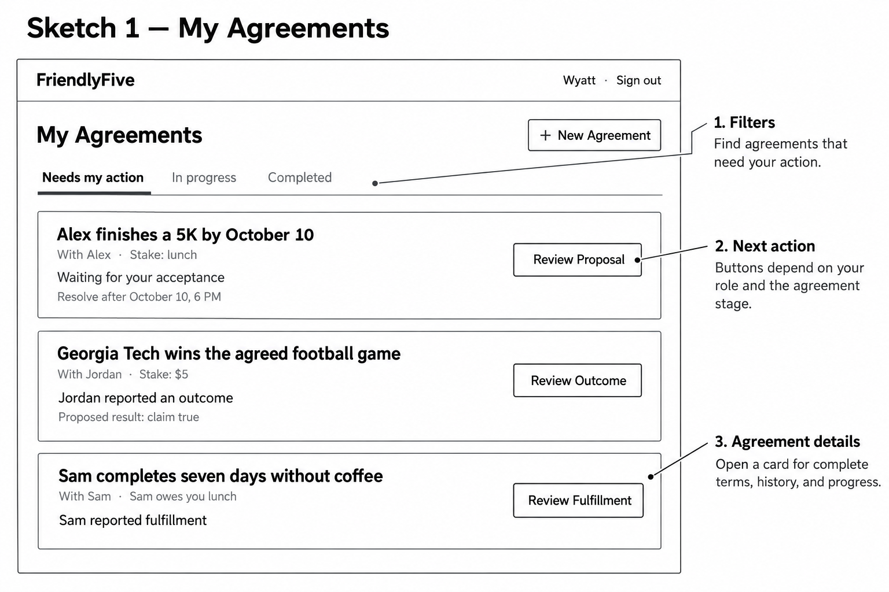
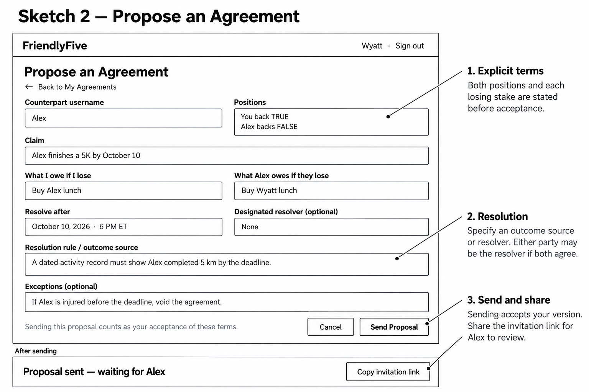
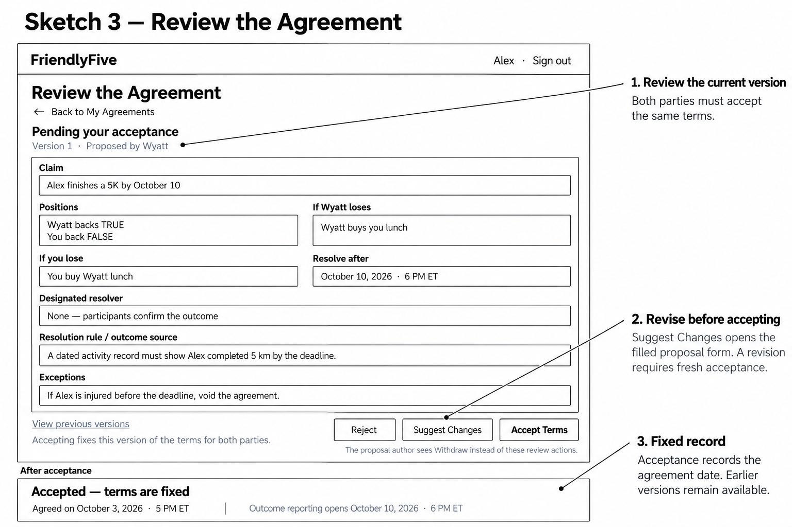
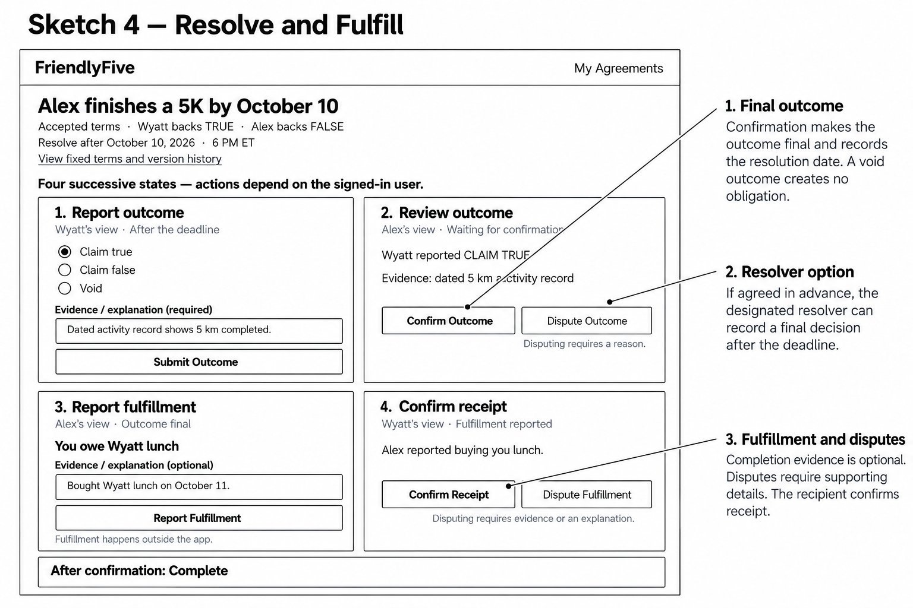
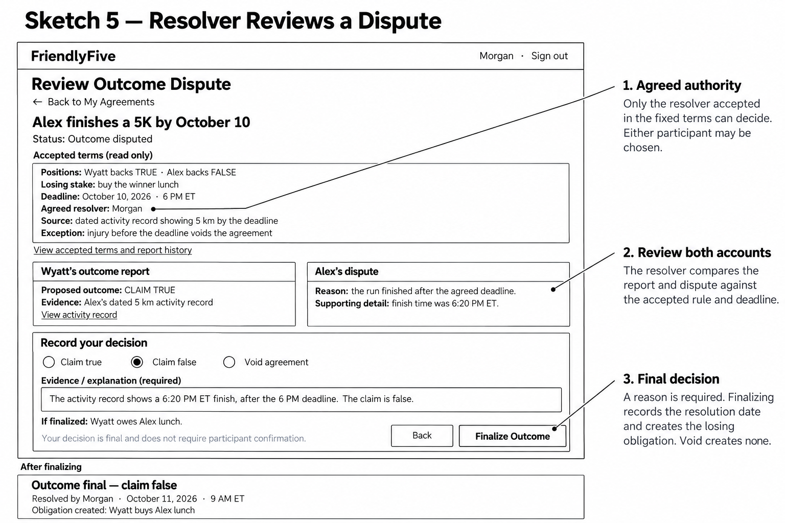

## Sketch 1 — My Agreements

The home screen helps users find agreements that need their attention. Each card shows the agreement’s status and the next action available to the signed-in user.

## Sketch 2 — Propose an Agreement

The proposer states the terms and how the outcome will be determined. Sending accepts that version and provides a link for the counterpart to review.

## Sketch 3 — Review the Agreement

The counterpart reviews the current terms and can accept, suggest changes, or reject. Terms are read-only here. The proposal author can revise or withdraw while it is pending. Acceptance fixes the terms and records the agreement date.

## Sketch 4 — Resolve and Fulfill

The panels show successive states of the agreement detail screen, with actions determined by the signed-in user’s role. A final outcome creates the losing party’s obligation, while a void outcome creates none. Completion evidence is optional, but disputing fulfillment requires evidence or an explanation. A disputed obligation remains open until the owing party submits a new completion report and the recipient confirms receipt.

## Sketch 5 — Resolver Reviews a Dispute

The agreed resolver reviews both accounts against the fixed terms and records a final outcome with supporting evidence or an explanation. The decision does not require further participant confirmation.